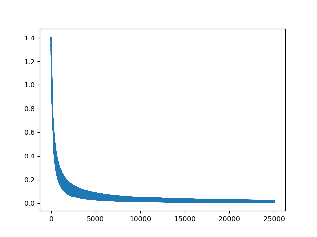

This repo represents the Neural Network project for the Machine Learning class at Montana State University. The code and paper were developed by Nicholas Stone and Matteo Bjornsson. 

# Neural Network
Neural networks are a type of supervised learning model. Given a set of data (e.g. such as photos of animals) that have a value associated with each data point (e.g. whether the photo is of a cat or a dog), the network can be trained to classify new information it was not trained on. In the "cats and dogs" example, given a new photo, the network would guess what class of animal the photo represented. 

 The network can be visualized as a series of layers. Each layer is composed of a certain number of nodes. Each node in one layer is connected to every other node in the next layer. At first, the network is initialized with random values at every node. However, by using a technique called backpropagation, the network can be trained to fine tune the values at every node such that it eventually does a pretty good job of estimating the value of the training data points. 
 
 For more details on what a neural network is and how backpropagation works, check out the final writeup below. 

# Project Code

This experiment can be run as follows:

```bash
python3 Driver.py
```

The experiment described in the paper below (10-fold cross validation of each data set, once for each 0, 1, and 2 hidden layers) will run its full course. Experimental results are appended to `experimental_results.csv`. 

### Plotting
For the benefit of the user (debugging, evaluating hyperparameters) the training of the neural network models for each case is plotted using `plt` calls in the `driver()` method in `Driver.py`. This code also happens to essentially represent the entire training loop for the each neural network. 

```python
    ...

    plt.ion
    counter = 1
    for i in range(epochs_d):
        for batch in batches:
            X_i = batch[0]
            labels_i = batch[1]
            NN.set_input_data(X_i, labels_i)
            NN.forward_pass()
            NN.backpropagation_pass()

        if i % 100 == 0:
            plt.plot(NN.error_x, NN.error_y)
            plt.draw()
            plt.pause(0.00001)
            plt.clf()
        counter += 1

    ...
```


These plots dramatically slow down calculation, so these lines should be commented out when actually running the experiment. 

### Dependencies
```
matplotlib
numpy
pandas
```
### Parallel Execution

If you wish to run this experiment in parallel, check out `ParallelDriver.py` instead of `Driver.py` which uses the `multiprocessing` library. 


# Project Writeup


# Video Walkthrough

This is a simple walkthrough demonstrating the experimental calculation output. 

https://www.youtube.com/watch?v=VpoCHxEAR2E